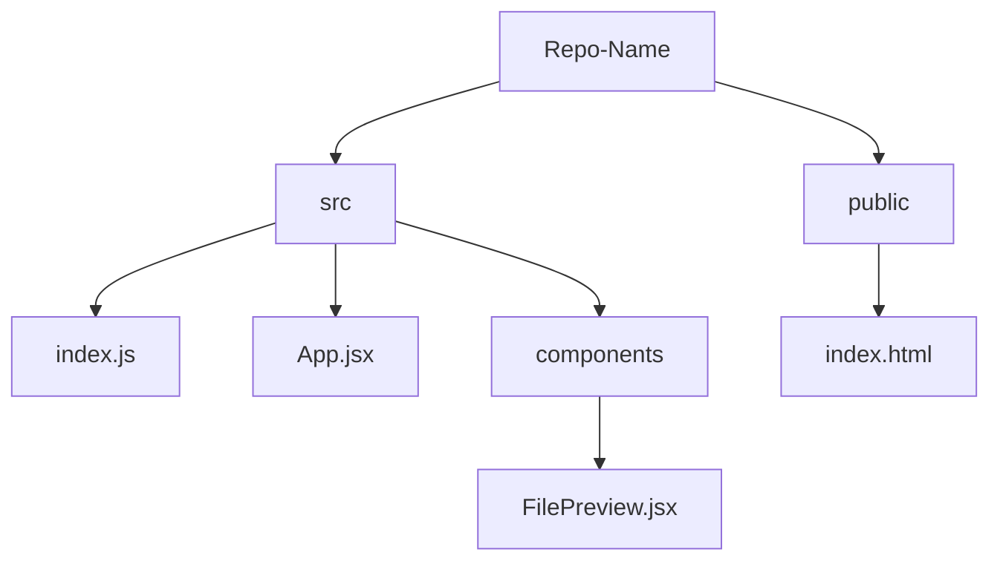

# CodeVerse - A GitHub Repository Visualizer

**Interactive visualization of GitHub repositories for easy exploration of file structures.**

---

## Overview

This project allows users to **visually explore the structure of any GitHub repository** in an intuitive and interactive way. It represents repositories as a **radial tree**, where directories and files are nodes, and provides **hover and click previews** for file contents.

- **Radial Tree Layout:** View your repository’s folder structure in a compact, circular layout.
- **Interactive Previews:** Hover over files to see a quick preview and click to view the full content in a scrollable window.
- **Search & Highlight:** Quickly locate files and directories with a live search.
- **Zoom & Pan:** Navigate large repositories easily with zooming and panning.

---

## Features

- **Dynamic visualization** of repository structure using D3.js
- **Hover previews** for quick content inspection
- **Click to expand** full file contents
- **Highlight search results** dynamically
- **Zoom and pan** for better navigation

---

## Tech Stack

- **Frontend:** React, D3.js, Tailwind CSS  
- **Backend:** Flask (fetches repository structure via GitHub API)  
- **APIs:** GitHub REST API for repo contents

---

## Usage

- 1. Enter a GitHub repository URL.
- 2. Visualize the folder structure.
- 3. Hover over a file node to see a preview.
- 4. Click on a file node to expand the full file content.

## How It Works

The repository structure is represented as a **radial tree**:

**Flow:**
1. Backend fetches the repo structure using the GitHub API.
2. Data is sent to the frontend React app.
3. D3.js constructs a **radial tree** from the repo structure.
4. Nodes represent files/folders:
   - **Folder nodes**: expandable
   - **File nodes**: hover for preview, click for full content
5. **Zooming and panning** lets users navigate large repositories comfortably.

---

## Future Improvements

- Syntax highlighting for previewed code
- Support for private repositories via GitHub OAuth
- Expandable subtrees for better large repo navigation
- Dark/light theme toggle
